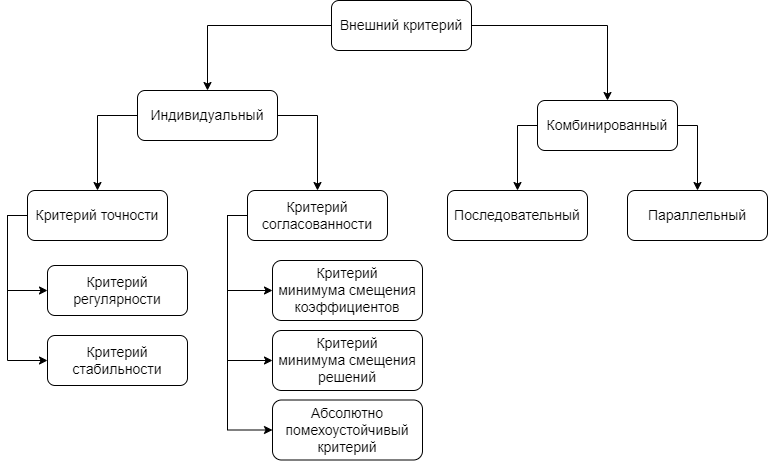

# Внешние критерии

Внешние критерии являются механизмами оценки качества моделей-кандидатов. Внешние критерии представляет собой формулы расчёта метрики - числового значения, которое характеризует то, насколько хорошо выбранная модель справляется со своей задачей. Значением метрики всегда является неотрицательное число. Чем меньше величина внешнего критерия, тем качественнее модель.

Однако каждая метрика помимо простого вычисления метрики по заданной формуле определяет также и способ использования {ref}`тренировочной и тестовой подвыборок<subsamples>`.

## Классификация внешних критериев

Все внешние критерии можно разделить на две большие категории: индивидуальные и комбинированные. Индивидуальные критерии используют один конкретный метод оценивая качества модели. Комбинированные критерии образуются путём одноременного либо поочерёдного использования двух независимых индивидуальных критериев.  

Кроме того, многие индивидуальные критерии имеют две формы: симметричную и несимметричную. Особенность симметричных критериев в том, что тренировочную и тестовую подвыборки они используют равноправно. Тогда как в несимметричных критериях тренировочная и тестовая подвыборки служат разным целям.

Классификация внешних критериев представлена на рисунке 1.

Рисунок 1. "Классификация внешних критериев"

## Обзор индивидуальных критериев

Индивидуальные критерии бывают двух видов: критерии точности и критерии согласованности. Критерии точности оценивают *ошибку* модели на определённых подвыборках. Критерии согласованности определяют *близость оценок* модели на разных подвыборках, но при этом не учитывают в явном виде ошибки моделей.

Далее при описании внешних критериев будут использоваться следующие обозначения:
- $A$ - тренировочная выборка;
- $B$ - тестовая выборка;
- $C$ - обучающая выборка, равная $A\cup{B}$;
<!--  
- $N_A$ - размер тренировочной выборки $A$;
- $N_B$ - размер тестовой выборки $B$;
- $N_C$ - размер обучающей выборки $C$, равный $N_A$+$N_B$;
  -->
- $X_A$ - матрица входных данных тренировочной выборки $A$;
- $X_B$ - матрица входных данных тестовой выборки $B$;
- $X_C$ - матрица входных данных обучающей выборки $C$, равная $X_A\cup{X_B}$;
  
- $y_A$ - вектор целевой величины тренировочной выборки $A$;
- $y_B$ - вектор целевой величины тестовой выборки $B$;
- $y_C$ - вектор целевой величины обучающей выборки $C$, равный $y_A\cup{y_B}$;
  
- $\hat{w}_A$ - вектор параметров модели, обученной на тренировочной выборке $A$;
- $\hat{w}_B$ - вектор параметров модели, обученной на тестовой выборке $B$;
- $\hat{w}_C$ - вектор параметров модели, обученной на обучающей выборке $C$;
  
- $E$ - значение внешнего критерия.

:::{note}
Выражение $||x||$ означает норму вектора евклидова пространства и вычисляется по формуле

$$||x||=\sqrt{\sum_{i=1}^nx_i^2}$$
:::

### 1. Критерий регулярности

Критерий регулярности относится к критериям точности и представляет собой среднеквадратичную ошибку.

* Несимметричная форма (`CriterionType.REGULARITY`):  

    <!--$$
    E=\sum_{i=1}^{N_B}(y_{Bi}-X_{Bi}\hat{w}_A)^2
    $$-->

    $$
    E=||y_{B}-X_{B}\hat{w}_A||^2
    $$

    Ошибка вычисляется для выборки $B$ для модели, обученной на выборке $A$.
  
* Симметричная форма (`CriterionType.SYM_REGULARITY`):  

    <!--$$
    E=\sum_{i=1}^{N_B}(y_{Bi}-X_{Bi}\hat{w}_A)^2 + \sum_{i=1}^{N_A}(y_{Ai}-X_{Ai}\hat{w}_B)^2
    $$-->

    $$
    E=||y_{B}-X_{B}\hat{w}_A||^2+||y_{A}-X_{A}\hat{w}_B||^2
    $$

    Используются сразу две модели. Одна обучается на выборке $A$ и делает прогнозы на выборке $B$. 
    Вторая модель, наоборот, обучается на выборке $B$ и делает прогнозы на выборке $A$.
    Итоговый результат складывается из суммы среднеквадратичных ошибок двух моделей.

### 2. Критерий стабильности

Критерий стабильности относится к критериям точности и отличается от критерия регулярности тем, что оценивает точность модели не только на новых данных, но и на тех, на которых она обучалась.
Благодаря этому оценка учитывает способности как аппроксимации, так и экстраполяции данных.

* Несимметричная форма (`CriterionType.STABILITY`):  

    <!--$$
    E=\sum_{i=1}^{N_C}(y_{Ci}-X_{Ci}\hat{w}_A)^2
    $$-->

    $$
    E=||y_{C}-X_{C}\hat{w}_A||^2
    $$

    Ошибка вычисляется для выборки $C$ для модели, обученной на выборке $A$.
  
* Симметричная форма (`CriterionType.SYM_STABILITY`):  

    <!--$$
    E=\sum_{i=1}^{N_C}(y_{Ci}-X_{Ci}\hat{w}_A)^2 + \sum_{i=1}^{N_C}(y_{Ci}-X_{Ci}\hat{w}_B)^2
    $$-->

    $$
    E=||y_{C}-X_{C}\hat{w}_A||^2 + ||y_{C}-X_{C}\hat{w}_B||^2
    $$

    Используются сразу две модели. Одна обучается на выборке $A$ и делает прогнозы на выборке $C$. 
    Вторая модель обучается на выборке $B$ и делает прогнозы также на выборке $C$.
    Итоговый результат складывается из суммы среднеквадратичных ошибок двух моделей.

### 3. Критерий минимума смещения коэффициентов

Критерий минимума смещения коэффициентов относится к критериям согласованности и имеет только симметричную форму.
Он основан на идее о том, что лучшей моделью является та, параметры которой практически не отличаются вне зависимости от данных, на которых модель обучалась.

* Симметричная форма (`CriterionType.UNBIASED_COEFFS`):  

    <!--$$
    E=(\hat{w}_A-\hat{w}_B)^2
    $$-->

    $$
    E=||\hat{w}_A-\hat{w}_B||^2
    $$

    Используются сразу две модели. Одна обучается на выборке $A$, другая - на выборке $B$.
    Чем более схожими получатся параметры моделей, тем меньше будет значение критерия.

### 4. Критерий минимума смещения решений

Критерий минимума смещения решений относится к критериям согласованности и является более распространённой формой критерия минимума смещения коэффициентов.
Он оценивает то, насколько похожими будут прогнозы модели, обученной на двух разных выборках.

* Несимметричная форма (`CriterionType.UNBIASED_OUTPUTS`):  

    <!--$$
    E=(X_{Bi}\hat{w}_A-X_{Bi}\hat{w}_B)^2
    $$-->

    $$
    E=||X_{B}\hat{w}_A-X_{B}\hat{w}_B||^2
    $$

    Используются сразу две модели. Одна обучается на выборке $A$ и строит прогнозы для выборки $B$. 
    Вторая модель обучается на выборке $B$ и строит прогнозы для выборки $B$. 
    Чем более схожими получатся два этих прогноза, тем меньше будет значение критерия.
  
* Симметричная форма (`CriterionType.SYM_UNBIASED_OUTPUTS`):  

    <!--$$
    E=(X_{Ci}\hat{w}_A-X_{Ci}\hat{w}_B)^2
    $$-->

    $$
    E=||X_{C}\hat{w}_A-X_{C}\hat{w}_B||^2
    $$

    Используются сразу две модели. Одна обучается на выборке $A$ и строит прогнозы для выборки $C$. 
    Вторая модель обучается на выборке $B$ и строит прогнозы для выборки $C$. 
    Чем более схожими получатся два этих прогноза, тем меньше будет значение критерия.

### 5. Абсолютно помехоустойчивый критерий

Абсолютно помехоустойчивый критерий требует максимальную согласованность прогнозов модели, раздельно обученной на трёх выборках. Данный критерий теоретически лучше остальных отсеивает избыточно сложные модели. 

* Несимметричная форма (`CriterionType.ABSOLUTE_NOISE_IMMUNITY`):  

    $$
    E=(X_B\hat{w}_C-X_B\hat{w}_A)^T(X_B\hat{w}_B-X_B\hat{w}_C)
    $$

    Используются сразу три модели. Одна обучается на выборке $A$, вторая - на выборке $B$, третья - на выборке $C$.
    Все модели строят прогнозы для выборки $B$. Чем более схожими будут прогнозы, тем меньше будет значение критерия.
  
* Симметричная форма (`CriterionType.SYM_ABSOLUTE_NOISE_IMMUNITY`):  

    $$
    E=(X_C\hat{w}_C-X_C\hat{w}_A)^T(X_C\hat{w}_B-X_C\hat{w}_C)
    $$

    Используются сразу три модели. Одна обучается на выборке $A$, вторая - на выборке $B$, третья - на выборке $C$.
    Все модели строят прогнозы для выборки $C$. Чем более схожими будут прогнозы, тем меньше будет значение критерия.

## Обзор комбинированных критериев

### 1. Параллельный критерий (`ParallelCriterion`)

Параллельный критерий представляет собой взвешенную сумму значений двух независимо рассчитанных индивидуальных критериев и рассчитывается по формуле:

$$
E=\alpha E_1+(1-\alpha)E_2, \;\;\; \alpha \in [0,1],

$$

где $E_1$ - значение первого индивидуального критерия,
$E_2$ - значение второго индивидуального  критерия,
$\alpha$ - весовой коэффициент. 

### 2. Последовательный критерий (`SequentialCriterion`)

Последовательный критерий также состоит из двух индивидуальных внешних критериев.
Первый критерий применяется для всех моделей-кандидатов текущего ряда. 
Из них отбирается подмножество из `top` лучших моделей и для них рассчитывается второй индивидуальный критерий, 
по значению которого окончательно определяются лучшие модели.